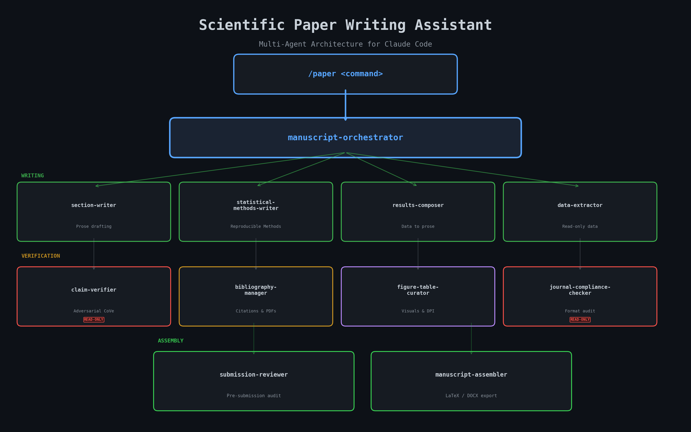
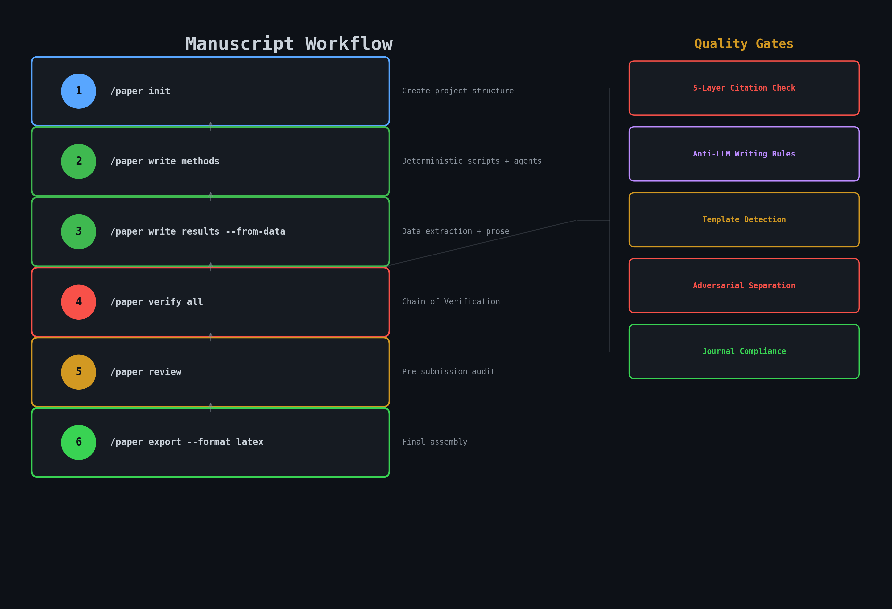
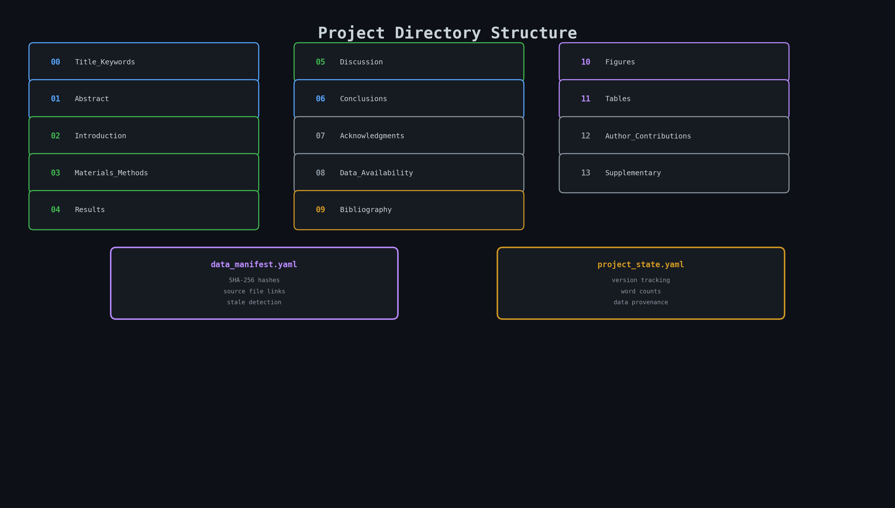

<p align="center">
  
</p>

<h1 align="center">Scientific Paper Writing Assistant</h1>

<p align="center">
  <strong>A multi-agent system for writing, verifying, and exporting scientific manuscripts in Claude Code</strong>
</p>

<p align="center">
  <a href="#installation"></a>
  <a href="LICENSE"></a>
  
  
</p>

<p align="center">
  <a href="#quick-start">Quick Start</a> &bull;
  <a href="#architecture">Architecture</a> &bull;
  <a href="#commands">Commands</a> &bull;
  <a href="#how-it-works">How It Works</a> &bull;
  <a href="#installation">Installation</a>
</p>

---

## What is this?

Scientific Paper Writing Assistant is a **Claude Code skill** that turns your research data into publication-ready manuscripts. It uses **11 specialized AI agents** that write, verify, format, and export your paper -- each with a strict role boundary.

The system enforces scientific rigor through:

- **Adversarial verification** -- read-only agents that challenge claims against cited sources
- **5-layer citation integrity** -- arXiv, CrossRef, Semantic Scholar, LLM relevance, retraction checks
- **Anti-LLM writing rules** -- bans 24 phrases that mark AI-generated text ("delve into", "it is worth noting", etc.)
- **Template content detection** -- 13 regex patterns that catch placeholder text before submission
- **Section contracts** -- Definition of Done checklists per section type

> **Status:** Phase 1 complete (architecture, orchestration, core scripts). Writing and verification agents are defined and ready for use.

---

## Quick Start

```bash
# In Claude Code, just use the /paper command:

/paper init ~/my-paper --journal "Nature"          # Create project structure
/paper write methods                                # Write Methods section
/paper write results --from-data                    # Extract data → Results prose
/paper verify all                                   # Chain of Verification on every claim
/paper bibliography add --doi 10.1038/s41586-024    # Add reference by DOI
/paper review                                       # Pre-submission audit
/paper export --format latex                        # Final LaTeX assembly
```

---

## Architecture

One orchestrator dispatches to 11 specialist agents, each with defined tools and boundaries:

<p align="center">
  
</p>

| Agent | Model | Role | Key Constraint |
|-------|-------|------|----------------|
| **manuscript-orchestrator** | Opus | Routes commands, manages state | Runs `update_state.py` after every write |
| **section-writer** | Opus | Drafts Abstract, Intro, Discussion, etc. | Anti-LLM rules, version bumping |
| **data-extractor** | Sonnet | Parses CSVs/scripts for statistics | **Read-only** -- never writes prose |
| **statistical-methods-writer** | Opus | Reproducible Methods (tests, params, versions) | 10-item Definition of Done |
| **results-composer** | Opus | Transforms data into Results prose | Data provenance via `data_manifest.yaml` |
| **bibliography-manager** | Sonnet | References, PDFs, citation checks | Retraction checking via CrossRef |
| **claim-verifier** | Opus | Chain of Verification on every claim | **Read-only adversarial** (no Edit/Write) |
| **figure-table-curator** | Sonnet | Figures, captions, DPI validation | 300 DPI dev, 900 DPI final |
| **journal-compliance-checker** | Sonnet | Word counts, format, reproducibility | **Read-only** (no Edit/Write) |
| **submission-reviewer** | Opus | Pre-submission audit orchestrator | Dispatches verifiers in parallel |
| **manuscript-assembler** | Sonnet | LaTeX/DOCX compilation + cover letter | Never modifies source files |

### Adversarial Separation

Two agents (`claim-verifier` and `journal-compliance-checker`) have `disallowedTools: [Edit, Write]`. They can only **report findings** -- they cannot fix what they find. This prevents the common failure mode where a verifier quietly "fixes" issues instead of flagging them.

---

## Commands

<p align="center">
  
</p>

| Command | What it does |
|---------|-------------|
| `/paper init <path>` | Create standardized project with 14 section directories |
| `/paper write <section>` | Draft or revise any section with anti-LLM style |
| `/paper verify [section\|all]` | Run claim verification + citation integrity |
| `/paper bibliography <action>` | Add, verify, format, or find missing references |
| `/paper figures <action>` | Validate, caption, or generate figures |
| `/paper tables <action>` | Validate or caption tables |
| `/paper review` | Full pre-submission audit (parallel agent dispatch) |
| `/paper status` | Show project progress, versions, word counts |
| `/paper guidelines <journal>` | Fetch + cache journal author guidelines |
| `/paper diff <section>` | Compare section versions side-by-side |
| `/paper respond-to-reviewers` | Point-by-point reviewer response generation |
| `/paper consistency-check` | Cross-section coherence validation |
| `/paper export --format <fmt>` | Final LaTeX or DOCX assembly + cover letter |

---

## How It Works

### Project Structure

Every manuscript project follows a standardized layout:

<p align="center">
  
</p>

```
my-paper/
├── 00_Title_Keywords/
├── 01_Abstract/
├── 02_Introduction/
│   └── cited_papers/          ← PDFs for verification
├── 03_Materials_Methods/
├── 04_Results/
│   ├── figures/               ← Source data for figures
│   └── tables/
├── 05_Discussion/
├── 06_Conclusions/
├── 07_Acknowledgments/
├── 08_Data_Availability/
├── 09_Bibliography/           ← All reference PDFs
├── 10_Figures/                ← Final publication figures
├── 11_Tables/
├── 12_Author_Contributions/
├── 13_Supplementary_Material/
├── project_state.yaml         ← Version tracking + word counts
├── data_manifest.yaml         ← SHA-256 hashes for data provenance
└── journal_guidelines.md      ← Cached journal requirements
```

### Version Control

Every section edit creates a new version file (`abstract_v1.0.txt` → `abstract_v1.1.txt`). The deterministic `update_state.py` script tracks versions, word counts, and modification dates without LLM involvement.

### 5-Layer Citation Verification

```
Layer 1: arXiv validation        → Verify preprint exists
Layer 2: CrossRef DOI lookup     → Confirm DOI resolves
Layer 3: Semantic Scholar match  → Title/year similarity ≥ 0.80
Layer 4: LLM relevance scoring   → Does citation support the claim?
Layer 5: Retraction check        → Flag retracted papers via CrossRef
```

### Quality Gates

| Gate | Mechanism | Threshold |
|------|-----------|-----------|
| Template content | 13 regex patterns | ≤ 5% of lines |
| Anti-LLM language | 24 banned phrases | Zero tolerance |
| Hedging frequency | Word-level scan | ≤ 3% |
| Section contracts | Per-type DoD checklist | All items pass |
| Figure DPI | Metadata extraction | 300 dev / 900 final |

---

## Installation

### Prerequisites

- [Claude Code](https://docs.anthropic.com/en/docs/claude-code) with **Opus 4.6**
- Python 3.11+ with `pyyaml` (`pip install pyyaml`)

### Setup

1. **Clone this repo:**
   ```bash
   git clone https://github.com/alestronati/Scientific-Paper-Writing-Assistant.git
   ```

2. **Copy skill to Claude Code:**
   ```bash
   cp -r scientific-paper-writer/skill/* ~/.claude/skills/scientific-paper-writer/
   ```

3. **Copy agent definitions:**
   ```bash
   cp scientific-paper-writer/agents/*.md ~/.claude/agents/
   ```

4. **Start using it:**
   ```bash
   claude
   > /paper init ~/my-paper --journal "Nature"
   ```

### Alternative: Direct install

```bash
# One-liner install
mkdir -p ~/.claude/skills/scientific-paper-writer ~/.claude/agents && \
git clone https://github.com/alestronati/Scientific-Paper-Writing-Assistant.git /tmp/spw && \
cp -r /tmp/spw/skill/* ~/.claude/skills/scientific-paper-writer/ && \
cp /tmp/spw/agents/*.md ~/.claude/agents/ && \
rm -rf /tmp/spw && \
echo "Done. Use /paper init to start."
```

---

## Writing Rules

The system enforces scientific writing standards by default:

**Banned phrases** (24 total): "delve into", "it is worth noting", "in the realm of", "plays a crucial role", "sheds light on", "paving the way", "a testament to", "offers valuable insights", "in today's rapidly evolving", "the findings underscore", "a nuanced understanding", "at the forefront", "offers a comprehensive", "this study contributes to", and more.

**Style rules:**
- Active voice preferred (passive flagged but not auto-corrected)
- No em dashes (use parentheses or commas)
- Citation format adapts to target journal
- Methods must include all software versions and exact test parameters
- Results must trace every number back to source data via `data_manifest.yaml`

All rules are configurable via `writing-rules-default.yaml`.

---

## Design Decisions

Key architectural choices documented in [`docs/DESIGN.md`](docs/DESIGN.md):

1. **Adversarial separation** -- Verifiers cannot edit, preventing self-correction bias
2. **Deterministic state** -- Python scripts (not LLMs) manage `project_state.yaml`
3. **Path-scoped rules** -- Writing rules activate per-section, not globally
4. **Data provenance** -- SHA-256 hashes link source files to Results paragraphs
5. **Evolution store** -- 30-day exponential decay on past lessons for self-improvement

---

## Testing

```bash
cd skill
python -m pytest tests/ -v
```

---

## Acknowledgments

This project integrates ideas and components from:

- **[AutoResearchClaw](https://github.com/OpenClaw/AutoResearchClaw)** (MIT) -- Template content detection, citation verification logic, writing rules, evolution store concept
- **[K-Dense Scientific Skills](https://k-dense.ai)** -- Scientific writing, citation management, peer review, and visualization skills
- **Chain of Verification (CoVe)** -- Dhuliawala et al. (2024), factored verification approach used by the claim-verifier agent
- **[Claude Code Superpowers](https://github.com/anthropics/claude-code)** -- Development workflows

---

## License

MIT License. See [LICENSE](LICENSE) for details.

---

<p align="center">
  <strong>Built by <a href="https://github.com/alestronati">Alessandro Stronati</a></strong>
  <br>
  <sub>Made with Claude Code</sub>
</p>
